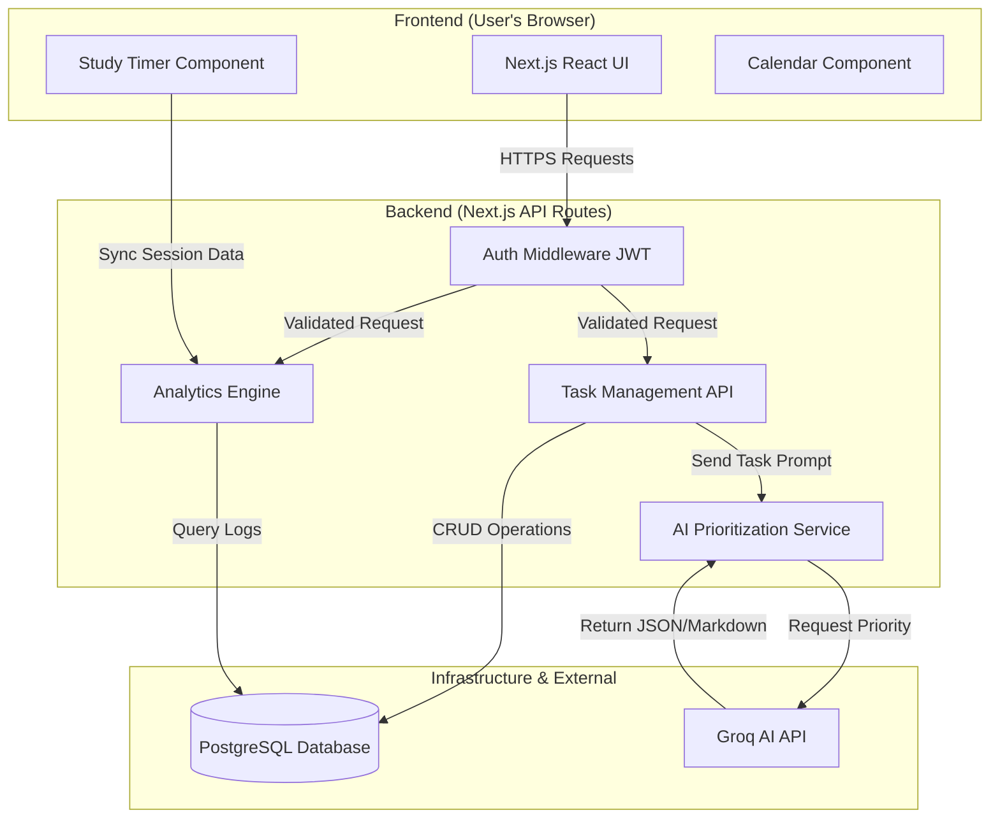

# HelpImTooLazy.com - Study Planner and Productivity Tracker

## 1. Project Information

- **Project Title:** HelpImTooLazy
- **Project Domain:** Study Planner & Productivity Tracker
- **Course:** Web Application Development and Security (COMP6703001)
- **Class:** L4BC

**Group Members:**
- **Michael Arianno Chandrarieta** / SID: 2802499711 / Role: Backend, AI-Designer, Security Handler / Github: MichaelFirstAC
- **Timothy Jonathan Imannuel** / SID: 2802521825 / Role: Frontend Lead, Debugger / Github: Timotimanuel12
- **Jason Franto Fong** / SID: 2802557781 / Role: Database, Deployment, UI-Tester, Documenter / Github: Jasonnnnnnn1

## 2. Instructor & Repository Access

This repository has been shared with: 

- **Instructor:** Ida Bagus Kerthyayana Manuaba (GitHub: `bagzcode`)
- **Instructor Assistant:** Juwono (GitHub: `Juwono136`)

---

## 3. Project Overview

### 3.1 Problem Statement

Students struggle to manage their study time effectively due to the lack of planning, organization, and difficulty in tracking deadlines, tasks, and progress. Most students use tools such as notebooks, calendars, or messaging apps, which are usually too inefficient. This can cause students to miss deadlines and lead to last minute studying leading to overall lower academic performance. The study planner will help by providing a way to plan study tasks, manage schedules, and monitor deadlines in a single platform.

Our target users are students whether it be in school or university who are in need to manage several courses or schedules at the same time. The system is designed in a way where it can support students with different study habits and schedules. It can also benefit self learners who want a simple and effective way to plan their study routines and improve overall productivity.

### 3.2 Solution Overview

We are developing a full-stack "Smart Study Planner" that automates the scheduling process.

**Main Features:**

* **Smart Scheduling:** Auto-allocates tasks into free calendar slots based on priority and deadlines.
* **Focus Timer:** A built-in Pomodoro-style timer to track actual study duration, integrated with ambient sounds and YouTube Music.
* **Progress Dashboard:** Visual analytics of study habits, priority breakdowns, and task completion rates.

**AI Integration:**

* **AI Scheduler/Prioritization:** Uses an algorithm to generate optimal daily schedules, preventing overlaps and overloading.
* **Dedicated AI Chat Assistant:** Powered by Groq SDK, providing an interactive chat room for study advice, schedule adjustments, and burnout detection.

---

## 4. Technology Stack

| Layer                | Technology            | Description                                                                       |
| -------------------- | --------------------- | --------------------------------------------------------------------------------- |
| **Frontend**         | **Next.js**           | React framework (App Router) for responsive UI and client-side rendering.         |
| **Backend**          | **Node.js (Express)** | Separate service handling business logic, AI processing, and API routes.          |
| **API**              | **RESTful API**       | Standard HTTP methods (GET, POST, PUT, DELETE) with JSON responses.               |
| **Database**         | **PostgreSQL**        | Relational database managed via **Prisma ORM** for structured task/schedule data. |
| **Auth**             | **Firebase Auth**     | Handles user identity (Google Sign-In) and token generation.                      |
| **Containerization** | **Docker**            | Dockerfiles for both Frontend and Backend; Docker Compose for orchestration.      |
| **Deployment**       | **Hosting platform**  | Dedicated Server                                                                  |
| **Version Control**  | **GitHub**            | Repository with main and feature branches.                                        |

---

## 5. System Architecture

### 5.1 Architecture Diagram



### 5.2 Architecture Explanation

The system is built on a **Client-Server Architecture** utilizing the Next.js framework to handle both the frontend interface and the backend API logic. The system follows a strict **Separation of Concerns** principle, ensuring that business logic, data access, and presentation layers are decoupled.

**Frontend (Presentation Layer):**
  - Built with **Next.js (App Router)** and **React** to ensure a responsive and interactive user interface.
  - Utilizes **Server-Side Rendering (SSR)** for the initial dashboard load to ensure performance and SEO, while using Client-Side Rendering (CSR) for interactive elements like the drag-and-drop calendar and study timer.
  - **Constraint:** The frontend never accesses the database directly; it strictly communicates via the REST API.

**Backend & API (Application Layer):**
  - Implemented using **Node.js** within **Next.js API Routes**.
  - Acts as the secure gateway and orchestrator of the system. It processes incoming HTTP requests, enforces business rules (e.g., checking for conflicting study sessions), and manages authentication sessions.
  - **AI Service:** The backend acts as a secure proxy to the AI provider (OpenAI). It receives raw user input, constructs the prompt, sends it to the LLM, and sanitizes the JSON response before returning it to the client. This ensures API keys are never exposed to the browser.

**Database Interaction (Data Layer):**
  - **PostgreSQL** is used as the primary relational database.
  - **Prisma ORM** is used for all database interactions. It provides type safety and prevents SQL injection by abstracting raw queries. We define a strict schema (`schema.prisma`) which enforces data integrity for Users, Tasks, and Study Sessions.

- **Security Enforcement:**
  - **Authentication:** Security is enforced using **JWT (JSON Web Tokens)** stored in HTTP-Only cookies to prevent XSS attacks.
  - **Authorization:** Middleware runs before every protected API route to verify the token signature. Row-Level Security logic is applied at the application layer; every database query includes a `where: { userId: currentUserId }` clause to ensure users can strictly access only their own data.
  - **Input Validation:** All incoming API payloads are validated using **Zod** schemas to reject malformed data before it reaches the database.

### 6. API Design

#### 6.1 API Endpoints

| Method | Endpoint | Description | Auth Required |
| --- | --- | --- | --- |
| **POST** | `/api/auth/register` | Registers a new user account. | No |
| **GET** | `/api/auth/session` | Validates Firebase ID token and returns session info. | Yes |
| **GET** | `/api/tasks` | Retrieves paginated tasks for the logged-in user. | Yes |
| **POST** | `/api/tasks` | Creates a new task. | Yes |
| **PUT** | `/api/tasks/[id]` | Updates task fields (e.g., status toggles). | Yes |
| **DELETE** | `/api/tasks/[id]` | Deletes a specific task. | Yes |
| **POST** | `/api/sessions` | Logs a completed study session (timer data). | Yes |
| **GET** | `/api/analytics` | Retrieves productivity stats (e.g., total study hours). | Yes |
| **POST** | `/api/ai/prioritize` | **AI Feature:** Analyzes task details to suggest priority. | Yes |
| **POST** | `/api/ai/chat` | **AI Feature:** Handles messages for the AI study assistant. | Yes |

* **Swagger UI Link:** Available locally at `http://localhost:3000/api-docs` when the server is running.
* **Example Request & Response (JSON):**

**POST `/api/tasks` Request:**

```json
{
  "title": "Complete WADS Final Project",
  "description": "Finish the README and presentation video.",
  "dueDate": "2026-06-20T23:59:00Z",
  "priority": "HIGH"
}

```

**Response (201 Created):**

```json
{
  "success": true,
  "data": {
    "id": "clx123abc0000def",
    "userId": "user_firebase_uid",
    "title": "Complete WADS Final Project",
    "status": "PENDING",
    "createdAt": "2026-06-14T11:00:00Z"
  }
}

```

## 7. Database Design

### 7.1 Database Choice

We chose **PostgreSQL** (managed via **Prisma ORM**).

* **Relational Structure:** Study planners require strict relationships (e.g., One User has Many Tasks; One Task has Many Study Sessions). SQL handles these foreign key relationships robustly.
* **Data Integrity & Security:** Prisma provides type safety and helps prevent SQL injection. It also allows us to easily enforce application-level row security constraints.
* **Performance:** PostgreSQL supports composite indexes (e.g., `userId + updatedAt`) which are critical for fast paginated queries on the dashboard. Firebase is used *only* for the Authentication layer to securely issue tokens.

### 7.2 Schema / Data Structure

* **User:** `id` (PK, matches Firebase UID), `email`, `name`, `themePreference`, `createdAt`
* **Task:** `id` (PK), `userId` (FK), `title`, `description`, `dueDate`, `priority`, `status`, `courseTag`
* **FocusSession:** `id` (PK), `userId` (FK), `taskId` (FK), `startTime`, `endTime`, `durationMinutes`
* **AIChat:** `id` (PK), `userId` (FK), `messageHistory` (JSON), `createdAt`

## 8. AI Features

### 8.1 AI Feature List

| AI Feature Purpose | AI Type |
| --- | --- |
| **Smart Task Prioritization & Scheduling:** Analyzes a user's pending tasks and constraints to automatically generate an optimized daily study schedule, identifying burnout risks. | Recommendation / Adaptive Logic |
| **Interactive Study Assistant:** A dedicated chat room powered by Groq that acts as an academic coach, capable of breaking down complex assignments into sub-tasks via natural language processing. | NLP / Conversational |

### 8.2 AI Integration Flow

1. **Input:** The user requests a schedule optimization or sends a chat message. The frontend securely sends this along with the JWT to the backend.
2. **AI Processing:** The Node.js backend retrieves the user's pending tasks and recent study history from PostgreSQL. It constructs a secure prompt containing this context and sends it to the Geroq SDK (via `GROQ_API_KEY` stored securely in server environment variables).
3. **Output:** The LLM returns a structured JSON payload (for scheduling) or Markdown text (for chat).
4. **Usage:** The backend sanitizes the output, logs the interaction, and sends it to the frontend. The frontend parses the JSON to render the calendar events or renders the Markdown in the chat UI.

---

## 9. Security Implementation

* **Authentication:** Handled via Firebase Auth. We utilize **JWT (JSON Web Tokens)** stored in HTTP-Only cookies to prevent XSS attacks.
* **Authorization:** A custom authentication middleware wraps every protected Next.js API route. It verifies the JWT signature. Furthermore, Row-Level Security logic is hardcoded into Prisma queries (e.g., `where: { userId: currentUserId }`) to guarantee users cannot access or modify others' data.
* **Input Validation:** All incoming request payloads are strictly validated against **Zod schemas**. Malformed requests are rejected with a standardized 400 error before ever reaching the database.
* **Protection against Attacks:**
* **SQL Injection:** Mitigated entirely by using Prisma ORM, which uses parameterized queries.
* **XSS:** Input sanitization middleware is applied. React automatically escapes variables in the frontend DOM.
* **CSRF:** Next.js App Router API routes inherently handle CORS. Auth tokens are validated strictly per request.


* **Secure API Key Handling:** Third-party API keys (Groq, Firebase Admin) are stored exclusively in backend `.env` variables and are never exposed to the client-side bundle.

---

## 10. Testing Documentation

*(Tests run via Jest: `npm run test -- --runInBand` — 109 tests passed across 9 suites)*

### 10.1 Frontend Testing

| Test Case | Scenario | Expected Result | Status |
| --- | --- | --- | --- |
| FE-01 | User logs in with valid Firebase credentials | Redirects to Dashboard, JWT cookie set | Pass |
| FE-02 | Timer completes a 25m Focus Session | Triggers API call to `/api/sessions`, updates UI stats | Pass |

### 10.2 Backend & API Testing

### 10.2 Backend & API Testing

| Test Case | Endpoint | Input | Expected Output | Status |
| --- | --- | --- | --- | --- |
| S01 | `/api/auth/register` | Valid new email + password >= 6 | 201 | Pass / Fail |
| S02 | `/api/auth/register` | Missing/invalid body (e.g., no email) | 400 | Pass / Fail |
| S03 | `/api/auth/register` | Email already exists | 409 | Pass / Fail |
| S04 | `/api/auth/register` | Firebase Admin failure (misconfigured credentials) | 500 | Pass / Fail |
| S05 | `/api/auth/session` | Valid bearer token | 200 | Pass / Fail |
| S06 | `/api/auth/session` | Missing/invalid bearer token | 401 | Pass / Fail |
| S07 | `/api/tasks` | Valid token | 200 | Pass / Fail |
| S08 | `/api/tasks` | Missing/invalid bearer token | 401 | Pass / Fail |
| S09 | `/api/tasks` | Valid payload (title, startTime, endTime) | 201 | Pass / Fail |
| S10 | `/api/tasks` | Invalid payload (e.g., endTime before startTime) | 400 | Pass / Fail |
| S11 | `/api/tasks` | Missing/invalid bearer token | 401 | Pass / Fail |
| S12 | `/api/tasks/{id}` | User A gets own task | 200 | Pass / Fail |
| S13 | `/api/tasks/{id}` | Missing/invalid bearer token | 401 | Pass / Fail |
| S14 | `/api/tasks/{id}` | User B tries to read User A task | 403 | Pass / Fail |
| S15 | `/api/tasks/{id}` | Non-existent id | 404 | Pass / Fail |
| S16 | `/api/tasks/{id}` | User A updates own task | 200 | Pass / Fail |
| S17 | `/api/tasks/{id}` | Invalid payload (e.g., bad date / end before start) | 400 | Pass / Fail |
| S18 | `/api/tasks/{id}` | Missing/invalid bearer token | 401 | Pass / Fail |
| S19 | `/api/tasks/{id}` | User B tries to update User A task | 403 | Pass / Fail |
| S20 | `/api/tasks/{id}` | Non-existent id | 404 | Pass / Fail |
| S21 | `/api/tasks/{id}` | User A deletes own task | 200 | Pass / Fail |
| S22 | `/api/tasks/{id}` | Missing/invalid bearer token | 401 | Pass / Fail |
| S23 | `/api/tasks/{id}` | User B tries to delete User A task | 403 | Pass / Fail |
| S24 | `/api/tasks/{id}` | Non-existent id | 404 | Pass / Fail |
| S25 | `/api/sessions` | Valid token | 200 | Pass / Fail |
| S26 | `/api/sessions` | Missing/invalid bearer token | 401 | Pass / Fail |
| S27 | `/api/sessions` | Valid payload | 201 | Pass / Fail |
| S28 | `/api/sessions` | Invalid payload (e.g., durationMinutes <= 0) | 400 | Pass / Fail |
| S29 | `/api/sessions` | Missing/invalid bearer token | 401 | Pass / Fail |
| S30 | `/api/analytics` | Valid token | 200 | Pass / Fail |
| S31 | `/api/analytics` | Missing/invalid bearer token | 401 | Pass / Fail |

### 10.3 Security Testing

| Test Case | Attack Type | Expected Behavior | Result |
| --- | --- | --- | --- |
| SEC-01 | XSS | Payload `<script>alert(1)</script>` in Task title | Sanitized by Zod/Middleware |
| SEC-02 | IDOR / Auth Bypass | Requesting `/api/tasks/USER_B_ID` while logged in as User A | Blocked by Prisma `userId` check (403/404) |

### 10.4 AI Functionality Testing

**AI Feature:** Smart Task Prioritization / Chat Assistant

| Test Case | Input | Expected Output | Actual Result | Status |
| --- | --- | --- | --- | --- |
| AI-01 | Valid input (List of 3 tasks) | Correct JSON array with assigned priorities | As Expected | Pass |
| AI-02 | Invalid input (Empty task list) | Graceful error / Fallback to default schedule | Handled | Pass |
| AI-03 | Prompt injection ("Ignore previous instructions") | Sanitized / Ignored by system wrapper prompt | Ignored | Pass |

**Failure Handling:**

* **AI Unavailable:** If the Groq SDK fails or returns a 500 error, the system catches the exception and returns a standardized error envelope. The frontend gracefully falls back to deterministic/manual scheduling.
* **Timeout:** Handled via `AbortController` in the fetch requests, triggering a timeout error message in the UI after 15 seconds.

---

## 11. Deployment & Production Setup

### 11.1 Docker Setup

* `Dockerfile` is included for containerizing the application.
* `docker-compose.yml` is configured to spin up the application and PostgreSQL database locally on `http://localhost:3000`.

### 11.2 Production Environment

* **Environment Variables:** Managed via `.env` (template provided in `.env.example`).
* **Secrets Handling:** Production secrets (Database URL, API Keys) are injected securely via the hosting platform's dashboard (e.g., Vercel Environment Variables). They are never hardcoded.
* **HTTPS:** Enforced automatically by Vercel for all frontend and API traffic.

### 11.3 Live Application URL

[https://helpimtoolazy.com](http://e2526-wads-b4bc.csbihub.id)

## 12. GitHub Contribution Summary (INDIVIDUAL)

**Student Name:** Michael Arianno Chandrarieta
* **Features implemented:** Designed and implemented the Node.js/Next.js backend architecture. Engineered the core AI assistant and smart scheduling logic using the Groq SDK.
* **API endpoints handled:** Managed AI-related endpoints (`/api/ai/prioritize`, `/api/ai/chat`) and core API routing middleware.
* **Tests written:** Authored backend integration tests and security/validation test suites.
* **Security work:** Implemented JWT authentication middleware, Zod input validation, XSS sanitization, and route protection.
* **AI-related work:** Designed system prompts, context retrieval logic, and fallback mechanisms for the Groq AI integration.

**Student Name:** Timothy Jonathan Imannuel
* **Features implemented:** Led the development of the Next.js React frontend, including the Dashboard, Drag-and-drop Calendar, and AI Chat UI. Handled complex cross-component state management and bug fixes.
* **API endpoints handled:** Integrated frontend fetch logic to securely communicate with all backend REST endpoints.
* **Tests written:** Authored unit tests for frontend UI components (e.g., ActivityCard, AddTaskModal) and handled end-to-end UI debugging.
* **Security work:** Ensured secure client-side routing, protected route redirection based on auth state, and handled client-side form validation.
* **AI-related work:** Built the interactive chat interface and implemented markdown rendering for the AI Assistant's outputs.

**Student Name:** Jason Franto Fong
* **Features implemented:** Designed the PostgreSQL database schema using Prisma ORM. Containerized the application using Docker and handled the live production deployment.
* **API endpoints handled:** Developed CRUD operations for Tasks and Sessions linked directly to the database layer, as well as the `/api/analytics` endpoint.
* **Tests written:** Executed comprehensive UI testing and end-to-end smoke tests post-deployment.
* **Security work:** Applied Row-Level Security (RLS) concepts in Prisma queries to ensure data isolation (users can only query their own data).
* **AI-related work:** Documented the AI integration flow, generated architectural diagrams, and maintained the OpenAPI/Swagger documentation (`/api-docs`).


---

## 13. AI Usage Disclosure

**AI tools used:** Groq API (Groq), Gemini (Google), Claude (Anthropic), Github Copilot.

* **Groq:** Used as a core system feature for the AI Assistant chat, task prioritization, burnout detection, and AI analytics.
* **Gemini:** Used during development to assist with brainstorming database schema optimizations, generating boilerplate unit test scenarios, and debugging Docker Compose port conflicts.
* **Claude:** Used during documentation to assist with weekly progress report deliverables.
* **Copilot:** Used during development to assist with the AI's design, algorithm, restrictions, and testing scenarios. 

All generated code was thoroughly reviewed, modified, and integrated manually by the team to ensure understanding and security compliance.

---

## 14. Known Limitations & Future Improvements

* **Current limitations:** * The calendar view does not yet sync directly with external Google/Outlook calendars.
* AI scheduling relies on prompt processing time, which can occasionally take up to 5-8 seconds depending on LLM load.


* **Possible future enhancements:** * Add a "Today Snapshot" panel and Quick Actions panel for immediate triage.
* Implement distributed rate limiting (Redis-based) and add 2FA/MFA support for accounts.


* **AI limitations and risks:** The AI may occasionally hallucinate incorrect task durations or fail to perfectly pack tasks if the schedule is mathematically impossible. The system relies on human-in-the-loop validation (the user can edit the generated schedule).

---

## 15. Final Declaration

We declare that:

* This project is our own work.
* AI usage is disclosed honestly.
* All group members understand the system.

**Signed by Group Members:**

* Michael Arianno Chandrarieta
* Timothy Jonathan Imannuel
* Jason Franto Fong

---

## 16. SETUP

1. **Clone & Install:**
```bash
git clone [repo_url]
cd helpimtoolazy
npm install

```


2. **Environment Setup:** Copy `.env.example` to `.env` and fill in your Firebase, Database, and Groq keys.
3. **Database Initialized:**
```bash
npx prisma generate
npx prisma migrate dev
npx prisma db seed

```


4. **Run via Docker (Recommended):**
```bash
docker-compose up --build

```


Access the app at `http://localhost:3000`.

## 17. DEPLOYMENT INSTRUCTIONS

Our application is deployed on a private Ubuntu server which was provided by our university using a fully automated CI/CD pipeline. The deployment relies on Docker for containerization and GitHub Actions for continuous integration.

### 17.1 Infrastructure & Environment Setup
* **Server Access:** The project is hosted via a CSBI infrastructure. We authenticated using our university credentials and accessed our private Ubuntu server environment through the web-based SSH terminal provided at csbiweb-ssh.csbihub.id.
* **Environment Variables:** All sensitive keys (Firebase credentials, Groq API Key, Database URL) are securely stored as a single GitHub Secret (`ENV_FILE`) in our repository settings to prevent exposing them in version control.
* **Firebase Authorization:** Because the app is deployed to a live domain, the domain (`e2526-wads-b4bc.csbihub.id`) was added to the **Authorized Domains** list inside the Firebase Authentication console to allow Google Sign-In outside of `localhost`.

### 17.2 CI/CD Pipeline (GitHub Actions)
* **Self-Hosted Runner:** We installed and configured a self-hosted GitHub Actions runner directly on the Ubuntu server. 
* **Service Execution:** The runner is kept alive in the background using `./run.sh` to continuously listen for new commits.
* **Pipeline Workflow (`cicd.yml`):**
   - Triggers automatically upon pushing to the `master` branch.
   - Securely injects the `.env` file from GitHub Secrets.
   - Executes deployment commands via the self-hosted runner.

### 17.3 Docker & Port Configuration
* **Production Compose File:** We use a specific `docker-compose.prod.yml` to control the frontend/backend services.
* **Port Mapping:** The application is explicitly mapped to run on port `3022` (`"3022:3000"`) inside the Docker configuration to match the port specifically assigned to our project by the lecturer.
* **Nginx Reverse Proxy:** The university's Nginx configuration forwards external traffic from our provided domain directly to our application's local port (`3022`).

### 17.4 Automated Deployment Steps
Whenever new code is pushed to `master`, the GitHub Action automatically performs the following on the Ubuntu server:
* `git pull` to fetch the latest codebase.
* Generates the `.env` file from GitHub Secrets.
* `docker-compose -f docker-compose.prod.yml down` to gracefully stop the old containers.
* `docker-compose -f docker-compose.prod.yml up -d --build` to rebuild the images and spin up the new containers in detached mode.

